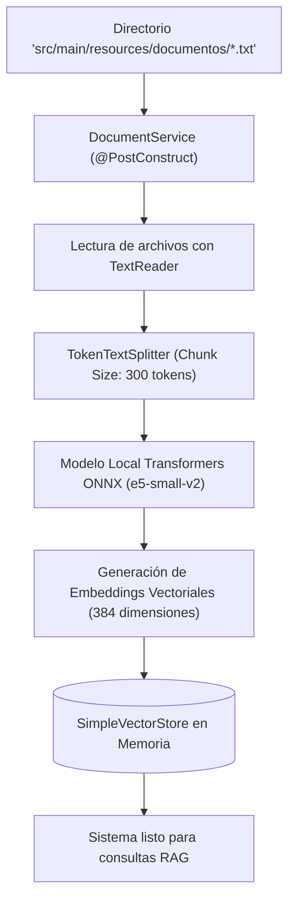
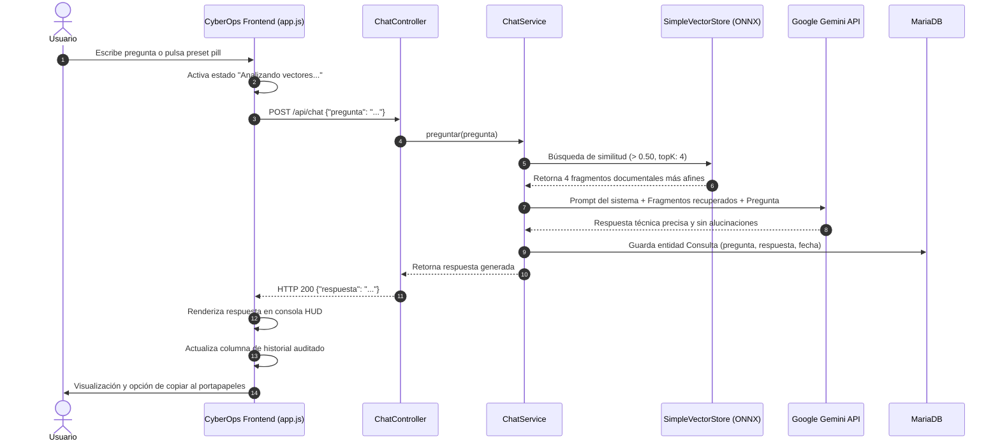

# 🛡️ MiniRAG Ciberseguridad

> **Asistente Inteligente de Ciberseguridad y Gestión de Redes fundamentado en Arquitectura RAG (*Retrieval-Augmented Generation*).**

[](https://www.oracle.com/java/)
[](https://spring.io/projects/spring-boot)
[](https://spring.io/projects/spring-ai)
[](https://ai.google.dev/)
[](https://mariadb.org/)
[-black.svg)](https://huggingface.co/intfloat/e5-small-v2)

---

## 📌 Tabla de Contenidos
- [Descripción General](#-descripción-general)
- [Arquitectura del Sistema](#-arquitectura-del-sistema)
- [Diagramas de Flujo](#-diagramas-de-flujo)
  - [1. Ingesta e Indexación Vectorial](#1-ingesta-e-indexación-vectorial-startup)
  - [2. Inferencia y Consulta en Tiempo Real](#2-inferencia-y-consulta-en-tiempo-real-runtime)
- [Stack Tecnológico](#-stack-tecnológico)
- [Base de Conocimiento Técnica](#-base-de-conocimiento-técnica)
- [Endpoints de la API REST](#-endpoints-de-la-api-rest)
- [Requisitos Previos](#-requisitos-previos)
- [Instalación y Puesta en Marcha](#-instalación-y-puesta-en-marcha)
- [Estructura del Proyecto](#-estructura-del-proyecto)
- [Interfaz Web (CyberOps HUD)](#-interfaz-web-cyberops-hud)
- [Manejo de Errores y Troubleshooting](#-manejo-de-errores-y-troubleshooting)

---

## 📖 Descripción General

**MiniRAG Ciberseguridad** es una solución web full-stack desarrollada para resolver dudas operativas y tácticas en materias de seguridad informática (hardening, protocolos de red, análisis de vulnerabilidades, firewalls y pentesting).

A diferencia de los asistentes conversacionales tradicionales que pueden "alucinar" o inventar datos, MiniRAG utiliza la técnica **RAG**:
1. Extrae y vectoriza localmente fragmentos de documentación técnica validada.
2. Al recibir una pregunta, recupera por similitud semántica los 4 fragmentos más relevantes.
3. Envía dichos fragmentos como contexto estricto al LLM (**Google Gemini**), obligándolo a responder **exclusivamente** con base en la información técnica existente.
4. Registra automáticamente cada consulta y respuesta en **MariaDB** para propósitos de auditoría y trazabilidad.

---

## 🏛️ Arquitectura del Sistema

```
┌────────────────────────────────────────────────────────────────────────┐
│                      FRONTEND: CyberOps HUD                            │
│  - Consola táctica interactiva (HTML5 / Modern Dark CSS / Vanilla JS)  │
│  - Telemetría en vivo de nodos (RAG Engine & MariaDB Sync)             │
│  - Acceso rápido a vectores predefinidos y panel de logs de auditoría  │
└───────────────────────────────────┬────────────────────────────────────┘
                                    │ HTTP REST (JSON)
                                    ▼
┌────────────────────────────────────────────────────────────────────────┐
│                      BACKEND: Spring Boot 3.4.x                        │
│                                                                        │
│   [ChatController] ──> [ChatService] <──> [QuestionAnswerAdvisor]      │
│          │                                        │                    │
│          │                                        ▼                    │
│          │                             [SimpleVectorStore]             │
│          │                             (Similitud semántica > 0.50)    │
│          │                                        ▲                    │
│          │                                        │ Embeddings locales │
│          │                             [Transformers ONNX Engine]      │
│          │                             (intfloat/e5-small-v2)          │
│          ▼                                        │                    │
│   [ConsultaRepository]                            ▼                    │
│          │                             [Google Gemini 3.5 Flash Lite]  │
│          │                             (Inferencia LLM sin cuota)      │
└──────────┼─────────────────────────────────────────────────────────────┘
           │ Spring Data JPA / JDBC
           ▼
┌───────────────────────────────────────┐
│         DATABASE: MariaDB             │
│  - Tabla `consultas` (Auditoría)      │
│  - Registro de Q/A con marca temporal │
└───────────────────────────────────────┘
```

---

## 🔄 Diagramas de Flujo

### 1. Ingesta e Indexación Vectorial (Startup)

Al iniciar Spring Boot, [`DocumentService`](file:///c:/Users/gamer/Downloads/taller-pr%C3%A1ctico-LLM-RAG/demo/src/main/java/com/llm_rag/demo/service/DocumentService.java) ejecuta automáticamente la preparación documental en memoria:



---

### 2. Inferencia y Consulta en Tiempo Real (Runtime)

Cuando el usuario envía una pregunta desde la consola web:



---

## 🛠️ Stack Tecnológico

| Capa / Componente | Tecnología | Propósito |
| :--- | :--- | :--- |
| **Lenguaje de Programación** | Java 21 LTS | Lenguaje base tipado y de alto rendimiento. |
| **Framework Backend** | Spring Boot 3.4.1 | Orquestación general, inyección de dependencias y servicios REST. |
| **Framework de IA** | Spring AI 1.1.4 | Integración fluida de modelos LLM, RAG advisors y vector stores. |
| **Modelo Generativo (LLM)** | Google Gemini `gemini-3.5-flash-lite` | Inferencia de lenguaje natural ultrarrápida (~1.2s) con cuota libre. |
| **Modelo de Embeddings** | ONNX `intfloat/e5-small-v2` | Vectorización semántica local y privada sin llamadas a APIs externas. |
| **Almacén Vectorial** | `SimpleVectorStore` (Spring AI) | Búsqueda por distancia de coseno en memoria. |
| **Base de Datos Relacional** | MariaDB 10.x / 11.x | Persistencia relacional de auditoría e historial de consultas. |
| **Acceso a Datos** | Spring Data JPA / Hibernate | Mapeo objeto-relacional (ORM) automático. |
| **Frontend UI** | HTML5, CSS3 Moderno, JavaScript Vanilla | Consola táctica HUD estilo *CyberOps* con modo oscuro y telemetría. |
| **Construcción / Build Tool** | Apache Maven 3.9+ (`mvnw`) | Gestión de dependencias y compilación del artefacto. |

---

## 📚 Base de Conocimiento Técnica

El sistema incluye documentos técnicos en `demo/src/main/resources/documentos/` que cubren:

1. **`analisis_vulnerabilidades.txt`:**
   * Definición y objetivos del análisis de vulnerabilidades.
   * Diferencia entre escaneo automatizado y **Pentesting** (Prueba de Penetración).
   * Fases del pentesting: Reconocimiento, Escaneo, Explotación, Post-explotación y Reporte.
2. **`bastionado.txt`:**
   * Concepto de **Bastionado de Servidores (*Hardening*)** y reducción de superficie de ataque.
   * Principio de menor privilegio para usuarios y procesos de sistema.
   * Cierre de puertos innecesarios, deshabilitación de servicios y configuración de firewalls.
3. **`protocolos_seguridad.txt`:**
   * **IPsec:** Funcionamiento, suites de cifrado, encapsulamiento y uso en redes VPN.
   * **TLS / SSL:** Integridad y privacidad en comunicaciones cliente-servidor para HTTPS.
   * **OSPF:** Configuración y seguridad en enrutamiento dinámico de estado de enlace.

---

## 🔌 Endpoints de la API REST

### 1. `POST /api/chat`
Envía una consulta técnica al motor RAG.

* **Headers:** `Content-Type: application/json`
* **Request Body:**
  ```json
  {
    "pregunta": "¿Para qué sirve el protocolo IPsec?"
  }
  ```
* **Response (HTTP 200 OK):**
  ```json
  {
    "respuesta": "El protocolo IPsec (Internet Protocol Security) sirve para autenticar y encriptar los paquetes de datos transportados a través de una red IP..."
  }
  ```

---

### 2. `GET /api/consultas`
Recupera el historial completo de auditoría almacenado en MariaDB.

* **Response (HTTP 200 OK):**
  ```json
  [
    {
      "id": 1,
      "pregunta": "¿Qué es el bastionado de servidores?",
      "respuesta": "El bastionado o hardening consiste en...",
      "fecha": "2026-09-30T17:48:12"
    }
  ]
  ```

---

### 3. `GET /api/salud`
Verifica el estado de disponibilidad del nodo RAG.

* **Response (HTTP 200 OK):**
  ```json
  {
    "estado": "OK",
    "aplicacion": "MiniRAG Ciberseguridad"
  }
  ```

---

## 📋 Requisitos Previos

Antes de ejecutar el proyecto, asegúrate de tener instalado:

1. **Java JDK 21** o superior (`java -version`).
2. **Apache Maven 3.9+** (o utilizar el wrapper incluido `./mvnw`).
3. **MariaDB Server** (o MySQL) en ejecución en el puerto `3306`.
4. **Google Gemini API Key:** Puedes generarla de manera gratuita en [Google AI Studio](https://aistudio.google.com/).

---

## 🚀 Instalación y Puesta en Marcha

### Paso 1: Clonar el repositorio
```bash
git clone https://github.com/tu-usuario/taller-practico-LLM-RAG.git
cd taller-practico-LLM-RAG/demo
```

### Paso 2: Configurar la Base de Datos MariaDB
Inicia tu cliente MariaDB/MySQL (o desde phpMyAdmin / DBeaver) y crea la base de datos:
```sql
CREATE DATABASE IF NOT EXISTS miniragdb CHARACTER SET utf8mb4 COLLATE utf8mb4_unicode_ci;
```

### Paso 3: Configurar la Clave de API de Gemini
Establece tu clave como variable de entorno del sistema:

* **En Windows (PowerShell):**
  ```powershell
  [System.Environment]::SetEnvironmentVariable('GEMINI_API_KEY', 'TU_API_KEY_AQUI', 'User')
  $env:GEMINI_API_KEY = "TU_API_KEY_AQUI"
  ```
* **En Linux / macOS:**
  ```bash
  export GEMINI_API_KEY="TU_API_KEY_AQUI"
  ```

### Paso 4: Revisar `application.properties`
Verifica la configuración en `demo/src/main/resources/application.properties`:
```properties
spring.application.name=demo
server.port=8080

# BASE DE DATOS MARIADB
spring.datasource.url=jdbc:mariadb://localhost:3306/miniragdb
spring.datasource.username=root
spring.datasource.password=
spring.datasource.driver-class-name=org.mariadb.jdbc.Driver
spring.jpa.hibernate.ddl-auto=update

# GEMINI AI
spring.ai.model.chat=google-genai
spring.ai.google.genai.api-key=${GEMINI_API_KEY}
spring.ai.google.genai.chat.options.model=gemini-3.5-flash-lite
spring.ai.google.genai.chat.options.temperature=0.2

# EMBEDDINGS LOCALES
spring.ai.model.embedding=transformers
spring.ai.embedding.transformer.tokenizer.uri=https://huggingface.co/intfloat/e5-small-v2/raw/main/tokenizer.json
spring.ai.embedding.transformer.onnx.model-uri=https://huggingface.co/intfloat/e5-small-v2/resolve/main/model.onnx
spring.ai.embedding.transformer.tokenizer.options.padding=true
```

### Paso 5: Compilar y Ejecutar
Compila el proyecto con Maven Wrapper:
```bash
./mvnw clean compile
./mvnw spring-boot:run
```
*(En Windows PowerShell puedes usar `.\mvnw.cmd spring-boot:run`)*

### Paso 6: Abrir en el Navegador
Abre tu navegador web e ingresa a:
👉 **`http://localhost:8080/`**

---

## 📂 Estructura del Proyecto

```text
taller-práctico-LLM-RAG/
└── demo/
    ├── pom.xml                                    # Dependencias de Spring Boot, Spring AI y MariaDB
    ├── mvnw / mvnw.cmd                            # Maven Wrapper multiplataforma
    └── src/
        ├── main/
        │   ├── java/com/llm_rag/demo/
        │   │   ├── DemoApplication.java          # Clase principal de arranque de Spring Boot
        │   │   ├── config/
        │   │   │   └── AiConfig.java             # Configuración del SimpleVectorStore
        │   │   ├── controller/
        │   │   │   └── ChatController.java       # Endpoints REST (/api/chat, /api/consultas, /api/salud)
        │   │   ├── model/
        │   │   │   └── Consulta.java             # Entidad JPA para persistencia en MariaDB
        │   │   ├── repository/
        │   │   │   └── ConsultaRepository.java   # Repositorio Spring Data JPA
        │   │   └── service/
        │   │       ├── ChatService.java          # Lógica de inferencia RAG con QuestionAnswerAdvisor
        │   │       └── DocumentService.java      # Carga, chunking y vectorización de documentos TXT
        │   └── resources/
        │       ├── application.properties        # Configuración de base de datos, Gemini y ONNX
        │       ├── documentos/                   # Base de conocimiento técnico para RAG
        │       │   ├── analisis_vulnerabilidades.txt
        │       │   ├── bastionado.txt
        │       │   └── protocolos_seguridad.txt
        │       └── static/                       # Frontend Web (CyberOps HUD)
        │           ├── index.html                # Estructura semántica de la consola táctica
        │           ├── styles.css                # Estilos modernos Dark Mode CyberOps
        │           └── app.js                    # Consumo REST, telemetría y renderizado dinámico
        └── test/                                 # Pruebas unitarias y de integración
```

---

## 🖥️ Interfaz Web (CyberOps HUD)

La interfaz de usuario fue diseñada bajo una estética táctica de centro de operaciones de seguridad:
* **Consola Táctica Central:** Textarea estilizada con contador dinámico de caracteres y soporte para envío con **`Ctrl + Enter`**.
* **Preset Pills:** Píldoras de consulta rápida para probar preguntas frecuentes con un solo clic.
* **Telemetría en Vivo:** Indicadores luminosos (*beacons*) que muestran el estado de conexión del nodo RAG (`ONLINE`/`OFFLINE`) y la sincronización con MariaDB mediante sondeos asíncronos cada 5 segundos.
* **Columna de Auditoría:** Historial ordenado cronológicamente con tarjetas de registro (`#AUDIT_LOG_N`), marcas de tiempo y respuestas previas almacenadas en la base de datos.
* **Utilidades Integradas:** Copia rápida al portapapeles con retroalimentación visual inmediata.

---

## 🔧 Manejo de Errores y Troubleshooting

### 1. Error de cuota `429 Too Many Requests` en Gemini
* **Causa:** El alias `gemini-flash-latest` apunta a modelos experimentales (como `gemini-3.8-flash`) que tienen un límite estricto de solo 20 peticiones en la capa gratuita.
* **Solución:** Configurar en `application.properties`:
  ```properties
  spring.ai.google.genai.chat.options.model=gemini-3.5-flash-lite
  ```
  Este modelo cuenta con cuota estándar libre y responde en ~1.2 segundos.

### 2. Error de compilación `illegal character: '\ufeff'`
* **Causa:** Guardado con codificación UTF-8 con BOM en Windows.
* **Solución:** Los archivos `.java` se encuentran libres de BOM. Si editas manualmente, asegúrate de guardar en tu editor como **UTF-8 sin BOM**.

### 3. Error `Connection refused: localhost:3306`
* **Causa:** El servicio de MariaDB o MySQL no está iniciado.
* **Solución:** Inicia el servicio desde los servicios de Windows (`services.msc`), XAMPP o terminal:
  ```powershell
  Start-Service MariaDB
  ```

---

## 📄 Licencia

Este proyecto fue desarrollado con fines educativos y de investigación aplicada para el taller práctico de **LLM y RAG**.
Distribuido bajo la licencia MIT. ¡Siéntete libre de utilizarlo, extenderlo y mejorarlo!
